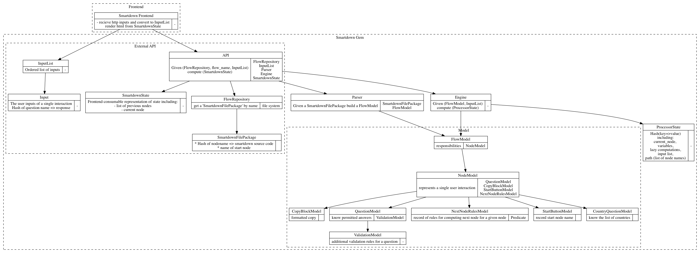

## Documentation quick links

- [Start Pages](start-pages.md)
- [Choices](choices.md)
- [Country Questions](country-questions.md)
- [Outcomes](outcomes.md)
- [Questions](questions.md)
- [Scenarios](scenarios.md)
- [General Glossary](glossary.md)

## Design diagram

